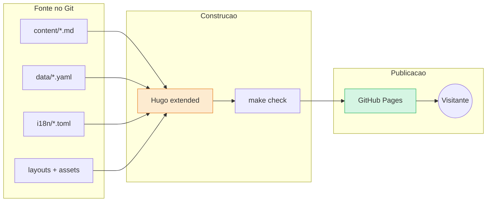

# Arquitetura do site

Hugo estático, multilingue, com blog.  |  TLDR: precisa de ser barato, rápido e fácil de editar -> site estático sem backend / custo: sem funções dinâmicas / ganho: segurança e 0 EUR de servidor / ~2 dias para o esqueleto

## Decisões

- **Hugo extended** (v0.165 está instalado nesta máquina)  |  TLDR: já usado no signorini -> reaproveitar conhecimento e esqueleto / ~0h
- **Sem framework JS, sem base de dados**  |  TLDR: menos peças que falham -> HTML, SCSS e JS mínimo / ganho: carrega depressa em 4G
- **Português (pt-PT) como língua por omissão**, `en` e `es` opcionais  |  TLDR: público é local -> `defaultContentLanguage = "pt"`; estrutura i18n pronta desde o início / custo: traduzir é opcional
- **Dados em YAML** para horários, turmas, contactos e instrutores  |  TLDR: informação repetida desatualiza-se -> um ficheiro por assunto em `data/` / ~2h
- **Tema claro e escuro** com contraste verificado  |  TLDR: acessibilidade -> variáveis CSS e `prefers-color-scheme` / ~3h

## Estrutura de pastas (proposta)

```
website/
  archetypes/blog.md        # modelo de artigo
  assets/scss/main.scss
  assets/js/main.js
  config/_default/          # hugo.toml, menus.pt.toml, menus.en.toml, menus.es.toml
  content/
    _index.pt.md
    a-academia.pt.md
    mestre-pedro-polvoa.pt.md
    turmas.pt.md
    horarios.pt.md
    contactos.pt.md
    blog/_index.pt.md
    blog/2026-exame-de-cintos.pt.md
  data/                     # horarios.yaml, turmas.yaml, contacto.yaml, site.yaml
  i18n/                     # pt.toml, en.toml, es.toml
  layouts/                  # baseof, partials, blog list e single
  static/                   # imagens, favicon, CNAME
  docs/                     # documentacao do projeto (nao e HTML publicado)
  Makefile
```

- **Pasta `docs/`** guarda documentação, não o HTML  |  TLDR: o signorini usava `docs/` para publicar -> aqui a publicação é feita por Actions ou `gh-pages` / ~0h

## Componentes



## Blog no Hugo

- **Secção `content/blog/`** com listagem paginada, página de artigo, etiquetas e RSS  |  TLDR: leitores e Google precisam de estrutura -> taxonomia `tags` ativa (o signorini desativa-a) / ~3h
- **Ficheiros por língua**: `slug.pt.md`, `slug.en.md`, `slug.es.md`  |  TLDR: mesma convenção do signorini -> verificação automática de que existe a versão `pt` / ~1h
- **Imagens por artigo** em page bundles (`content/blog/<slug>/index.pt.md` + imagens)  |  TLDR: fotos soltas em `static/` perdem-se -> bundle mantém imagem junto do artigo; Hugo redimensiona / ~1h

## SEO e partilha

- **Metadados**: `description`, Open Graph, `sitemap.xml`, `robots.txt`, `lang` correto  |  TLDR: partilha no WhatsApp e Google -> partial `head` único / ~2h
- **Dados estruturados**: `SportsActivityLocation` ou `LocalBusiness` na página de contactos  |  TLDR: aparecer no mapa e na pesquisa local -> JSON-LD com morada e horário / ~1h
- **Google Business Profile** da academia  |  TLDR: pesquisa "taekwondo Porto" -> perfil gratuito, ligado ao site / fora do repositório / ~1h

## Verificações automáticas (alvo `make check`)

- **`make build`**: Hugo sem avisos  |  TLDR: erros silenciosos -> falhar em avisos / ~30 min
- **Ligações**: verificação de links internos e externos  |  TLDR: links partidos -> ferramenta de links no CI / ~1h
- **Idiomas**: todo artigo tem versão `pt`  |  TLDR: regra do blog -> um script único / ~1h
- **Imagens**: texto alternativo e tamanho máximo  |  TLDR: acessibilidade e peso -> script de verificação / ~1h

## Privacidade e legal

- **RGPD**: sem cookies de seguimento no início, sem analítica, ou analítica sem cookies  |  TLDR: evita banner de cookies -> decidir antes de adicionar qualquer script / ~0h
- **Mapa**: ligação para o mapa em vez de iframe  |  TLDR: iframes de terceiros colocam cookies -> link simples ou imagem estática / ~15 min
- **Página de privacidade** curta  |  TLDR: obrigação com dados de contacto -> texto simples a rever com o Mestre / ~1h
