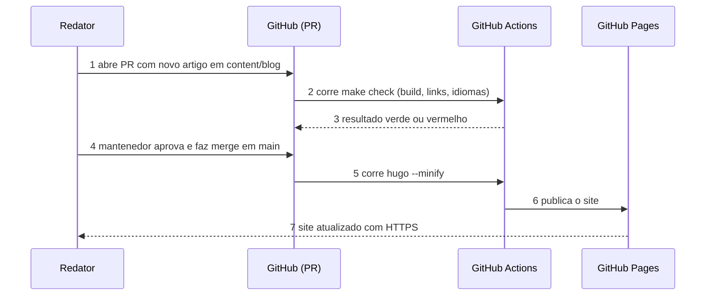
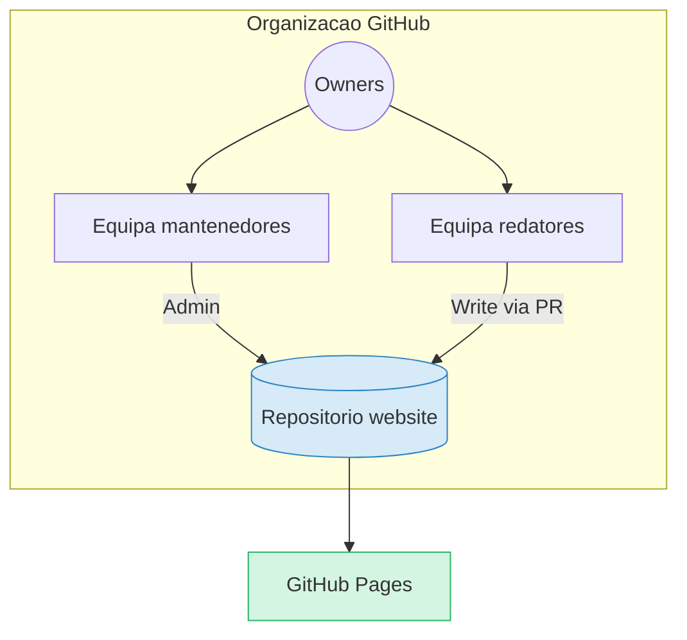

# Organização GitHub e repositório

Como criar a organização e alojar o site.  |  TLDR: o site precisa de casa pública e com várias pessoas -> organização GitHub com um repositório e GitHub Pages / custo: plano Free chega / ~1h

## Estado atual

- **Repositório local**: `/opt/js/tkd_predro_plovoa`, ramo `master`, sem commits e sem remoto  |  TLDR: nada publicado -> criar o repositório remoto na organização e ligar / ~10 min
- **`gh` CLI**: o token da conta `ivensfernando` está inválido  |  TLDR: `gh repo create` falha -> executar `gh auth login -h github.com` (o utilizador, no terminal com `! gh auth login -h github.com`) / ~2 min
- **Ramo**: local é `master`, o ramo principal convencionado é `main`  |  TLDR: nomes diferentes confundem PRs -> renomear antes do primeiro commit com `git branch -M main` / ~1 min

## Passo 1 — Criar a organização (manual, interface web)

- A API do GitHub e o `gh` **não criam** organizações normais  |  TLDR: não dá para automatizar -> o utilizador cria em https://github.com/account/organizations/new / ~5 min
- **Plano**: Free  |  TLDR: não há custo -> escolher "Create a free organization" / custo: 0
- **Nome escolhido**: `taekwondo-pedro-polvoa` (criada)  |  TLDR: o nome faz parte do URL -> site em `https://taekwondo-pedro-polvoa.github.io/website/` / alterar depois parte ligações
- **Email de contacto da organização**: um email da academia, não pessoal  |  TLDR: evita perder acesso se a pessoa sair -> usar email partilhado / ~0h
- **Pertence a**: "A personal account" (o utilizador como proprietário)  |  TLDR: gestão simples -> adicionar o Mestre ou um responsável como segundo Owner para não haver ponto único de falha / ~5 min

## Passo 2 — Definições da organização

- **Dois Owners no mínimo**  |  TLDR: um Owner perdido bloqueia tudo -> convidar um segundo Owner de confiança / ~5 min
- **2FA obrigatório** (Settings -> Authentication security)  |  TLDR: contas roubadas publicam lixo no site -> exigir 2FA a todos os membros / ~5 min
- **Permissão base dos membros**: Read  |  TLDR: evita alterações acidentais -> dar Write só a quem publica artigos / ~2 min
- **Equipas**: `mantenedores` (Write/Admin), `redatores` (Write no repositório do site)  |  TLDR: escrever artigos sem mexer em código -> redatores editam `content/` pelo browser e abrem Pull Request / ~10 min
- **Perfil público**: logótipo, descrição, ligação para o site  |  TLDR: credibilidade -> preencher quando houver logótipo / ~10 min

## Passo 3 — Repositório do site

- **Nome: `website`** (criado, vazio, atualmente PRIVADO), remoto `git@github.com:taekwondo-pedro-polvoa/website.git`  |  TLDR: repositório com este nome serve em `/website/` -> `baseURL` com subcaminho / drawback: URL maior e Pages exige repositório público (plano Free) / ~0h
- **Visibilidade**: pública  |  TLDR: GitHub Pages gratuito exige repositório público no plano Free -> aceitar; não pôr dados pessoais no repositório / custo: tudo é público
- **Ramo por omissão**: `main`, com proteção (PR obrigatório, 1 revisão)  |  TLDR: evita publicar erros diretamente -> regras de ramo / ~10 min
- **Ficheiros iniciais**: `README.md`, `.gitignore` (`public/`, `resources/`, `.hugo_build.lock`), `LICENSE` para o código; conteúdo e fotos ficam com "todos os direitos reservados" salvo decisão contrária  |  TLDR: licenças confusas -> separar código e conteúdo / ~15 min

Comandos, depois de `gh auth login` e da organização criada (executar só após confirmação do utilizador):

```bash
git branch -M main
# repositorio ja criado pelo utilizador; o remoto origin ja esta ligado (ramo main)
```

Estes comandos fazem commit e push? Não: `gh repo create --source` só cria o repositório e liga o remoto. O primeiro commit e o push continuam a ser pedidos explicitamente pelo utilizador.  |  TLDR: dúvida sobre efeitos -> `--push` não é usado / ~0h

## Passo 4 — Publicação (GitHub Pages)

- **Opção recomendada: GitHub Actions** (Settings -> Pages -> Source: GitHub Actions) com a ação oficial de Hugo  |  TLDR: evita guardar HTML gerado no repositório -> workflow constrói e publica a cada push em `main` / custo: um ficheiro `.github/workflows/pages.yml` / ~1h
- **Alternativa: ramo `gh-pages` com `deploy.sh`** como no signorini  |  TLDR: funciona sem Actions -> script local publica / drawback: publicação manual / ~30 min
- **Não usar** a pasta `/docs` de `main` para o HTML  |  TLDR: aqui `docs/` guarda documentação do projeto -> usar Actions ou `gh-pages`

## Passo 5 — Domínio

- **DECIDIDO: por agora, sem domínio próprio**; o site fica em `https://taekwondo-pedro-polvoa.github.io/website/`  |  TLDR: precisa de ser mostrado ao Mestre já -> GitHub Pages grátis, sem DNS / custo: URL menos profissional / ~0h
- **Alternativa futura**: um repositório chamado `taekwondo-pedro-polvoa.github.io` serve na raiz, sem `/website/`  |  TLDR: URL mais curto e troca para domínio próprio sem mudar ligações -> criar mais tarde se o Mestre aprovar / ~15 min
- **`baseURL`** em `config/_default/hugo.toml` = `https://taekwondo-pedro-polvoa.github.io/website/`; sem `CNAME` por enquanto  |  TLDR: ligações e sitemap corretos -> usar `relURL`/`absURL` nos layouts, nunca caminhos começados por `/`; alterar só quando houver domínio / ~2 min
- **Aviso: o repositório é PRIVADO e o Pages grátis exige público**  |  TLDR: sem mudar a visibilidade o site não publica -> decidir com o utilizador: tornar o repositório público (site visível e indexável por todos) ou pagar plano Team; não mudar sozinho / ~2 min

Quando houver domínio (adiado):

- **Registar** um domínio `.pt` (DNS.PT) ou `.com` num registrador  |  TLDR: `*.github.io` parece provisório -> domínio próprio / custo: cerca de 10 a 15 EUR/ano / ~30 min
- **DNS**: registos A/AAAA do GitHub Pages para o apex e CNAME `www` -> `<org>.github.io`  |  TLDR: HTTPS e domínio certos -> seguir a documentação oficial do GitHub Pages à data / ~30 min
- **Ficheiro `CNAME`** em `static/CNAME` e "Enforce HTTPS" ativo  |  TLDR: certificado automático -> ligar após o DNS propagar / ~5 min

## Fluxo de publicação



## Estrutura da organização



## O que o utilizador tem de fazer

- **1.** Responder às perguntas de nome e domínio em `planeamento.md`  |  TLDR: bloqueia a criação -> 5 min
- **2.** Criar a organização na interface web  |  TLDR: não automatizável -> 5 min
- **3.** Executar `! gh auth login -h github.com`  |  TLDR: token inválido -> 2 min
- **4.** Confirmar a criação do repositório  |  TLDR: ação pública -> depois o comando acima corre numa linha
